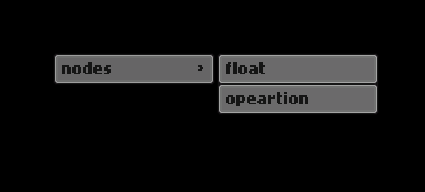
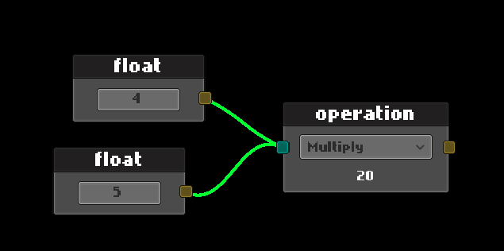

Welcome to the RuntimeNodeEditor documentation. 

# Quick overview

- RuntimeNodeEditor is a unityUI based node editor and works in playmode.

- A connection happens between a `InputSocket.cs` and `OutputSocket.cs` all derived from `Socket.cs`.

- A `Node.cs` is a container for sockets. It listens connection events for its sockets.

- A `NodeGraph.cs` can create nodes and draws connections between sockets. Can be exported or serialized into json file.

- `NodeEditor.cs` is derives from `MonoBehavior` and lives in the scene. Can listen graph events. It has a simple context menu feature.

- It is possible to have multiple node editors in a scene. Each editor will handle its events and process them.

- Works completely event based. Integrates with unity `EventSystem` to listen pointer events for sockets, nodes and graph.

- Customizable for every detail. Some parts of the framework require manual work 


# Getting started

RuntimeNodeEditor is intended as a framework to work easily in a unity scene. 
It can be setup with a minimal configuration and its event based flow allows users to create their system on top of it. 

## Quick tutorial

Simply extend the `NodeEditor`.

```c#
public class MyNodeEditor : NodeEditor
{
    public override void StartEditor(NodeGraph graph)
    {
        base.StartEditor(graph);

        //  make your custom initialization here
    }
}
```

```c#
public class ApplicationStartup : MonoBehaviour
{
    public RectTransform        editorHolder;   //nested in a canvas object
    
    private MyNodeEditor   _editor;

    private void Start()
    {
        _editor = gameObject.AddComponent<MyEditor>();        
        var graph = _editor.CreateGraph<NodeGraph>(editorHolder, Color.black, Color.green);
        _editor.StartEditor(graph);
    }
}
```

If we run this example, a graph will be created as a child in `editorHolder` object. But editor and graph won't do anything. Let's add some functuionality.

RuntimeNodeEditor relies on `Resorces` folder to create node prefabs. Project comes with a couple of examples. We'll use the sample nodes like below.

```c#
public class MyNodeEditor : NodeEditor
{
    public override void StartEditor(NodeGraph graph)
    {
        base.StartEditor(graph);

        //  make your custom initialization here

        //  use fluent builder create a context
        var ctx = new ContextMenuBuilder()

        .Add("nodes/float", ()=> Graph.Create("Nodes/FloatNode"))
        .Add("nodes/opeartion", ()=> Graph.Create("Nodes/MathOperationNode"))
        .Build();

        //  set the context
        SetContextMenu(ctx);
    }
}
```

Now we should tell how to display the context menu.

```c#
public class MyNodeEditor : NodeEditor
{
    public override void StartEditor(NodeGraph graph)
    {
        base.StartEditor(graph);

        //  make your custom initialization here

        //  use fluent builder create a context
        var ctx = new ContextMenuBuilder()

        .Add("nodes/float", ()=> Graph.Create("Nodes/FloatNode"))
        .Add("nodes/opeartion", ()=> Graph.Create("Nodes/MathOperationNode"))
        .Build();

        //  set the context
        SetContextMenu(ctx);

        //  listen graph events
        Events.OnGraphPointerClickEvent += OnClick;
    }

    private void OnClick(PointerEventData eventData)
    {
        //  handle event
    }
}
```

We subscribe to `OnGraphPointerClickEvent` to listen pointer events on graph. Let's add what to do.

```c#
public class MyNodeEditor : NodeEditor
{
    ...

    private void OnClick(PointerEventData eventData)
    {
        if(eventData.button == PointerEventData.InputButton.Left)
        {
            CloseContextMenu();
        }
            
        if(eventData.button == PointerEventData.InputButton.Right)
        {
            DisplayContextMenu();
        }
    }
}
```

Let's right click and see the result.



Last part is the context menu prefab, it also comes with samples. You can modify the prefab's visuals to fit for your needs easily.

```c#
public class ApplicationStartup : MonoBehaviour
{
    public RectTransform editorHolder;
    public GameObject   ctxMenuPrefab; // 1. assigned from the scene
    
    private MyEditor   _editor;

    private void Start()
    {
        _editor = gameObject.AddComponent<MyEditor>();
        _editor.contextMenuPrefab = ctxMenuPrefab;  // 2. assign to editor
        
        var graph = _editor.CreateGraph<NodeGraph>(editorHolder, Color.black, Color.green);
        _editor.StartEditor(graph);
    }
}
```

Note that context menu is an optional feature. `NodeEditor` won't need it in order to operate.

Now if you hit play, you can zoom in/out with middle mouse scroll, middle button drag to navigate and connect sockets from your nodes.



Here is the complete sample: 

```c#
public class MyEditor : NodeEditor
{
    public override void StartEditor(NodeGraph graph)
    {
        base.StartEditor(graph);

        var ctx = new ContextMenuBuilder()
            .Add("nodes/float", ()=> Graph.Create("Nodes/FloatNode"))
            .Add("nodes/opeartion", ()=> Graph.Create("Nodes/MathOperationNode"))
            .Build();

        SetContextMenu(ctx);

        Events.OnGraphPointerClickEvent += OnClick;
    }

    private void OnClick(PointerEventData eventData)
    {
        if(eventData.button == PointerEventData.InputButton.Left)
        {
            CloseContextMenu();
        }
            
        if(eventData.button == PointerEventData.InputButton.Right)
        {
            DisplayContextMenu();
        }
    }
}
```

```c#
public class ApplicationStartup : MonoBehaviour
{
    public RectTransform editorHolder;
    public GameObject   ctxMenuPrefab;
    
    private MyEditor   _editor;

    private void Start()
    {
        _editor = gameObject.AddComponent<MyEditor>();
        _editor.contextMenuPrefab = ctxMenuPrefab;
        
        var graph = _editor.CreateGraph<NodeGraph>(editorHolder, Color.black, Color.green);
        _editor.StartEditor(graph);
    }
}
```


## Core concepts

- Socket and Connection
- Node
- NodeGraph
- NodeEditor
- ContextMenu
- Serializing

### Socket and Connection

> `output(value)` --> connection --> `input`

A single connection happens between an input and an output socket. 
This is a one-direction communication from the output to input. An input may accept single or multiple connections. 

`SocketInput` and `SocketOutput` is implemented to work as generic sockets derived from abstract `Socket`. 

`SocketOutput` implements `IOutput` interface to make it easy to share and read the incoming value as an object.

```c#
public interface IOutput
{
    T GetValue<T>();
    event Action ValueUpdated;
}
```

### Node

```c#
public class SampleNode : Node
{
    public SocketOutput myOutput;
}
```

`Node` is a hub for sockets. It registers and controlls its sockets when a connection invoked. 


When a connection established, input socket's owner node invokes the `OnConnectionEvent` event.


```c#
public class SampleNode : Node
{
    ...
    
    //  fields
    //  ui objects fields
    //  input or output sockets 

    ...

    public override void Setup()
    {
        //  setup your custom node here

        OnConnectionEvent += OnConnection;
        OnDisconnectEvent += OnDisconnect;
    }

    public void OnConnection(SocketInput input, IOutput output)
    {
        output.ValueUpdated += OnConnectedValueUpdated;
    }

    public void OnDisconnect(SocketInput input, IOutput output)
    {
        output.ValueUpdated -= OnConnectedValueUpdated;
    }
}
```

This way it is possible to listen connection and disconnection events to get information from outputs

### NodeGraph

`NodeGraph` will contain nodes, connections and connection curves. Graph can create a node by providing its prefab path from `Resources` folder.

```c#
public class MyNodeEditor : NodeEditor
{
    ...

    private void SomeMethod()
    {
        Graph.Create("path/to/prefab/in/Resources");
    }
}

```

Following a prefab path is a design decision. It has a certain benefits to make prefab instantiation easy (and serialization)but comes with some manual work for sure. 

Graph connects sockets by listening pointer events by default. It is possible to override its virtual methods or make costumizations.

It also listen the pointer events from graph, nodes and connections. Check out `SignalSystem.cs` for the complete events.


### NodeEditor

`NodeEditor` is the central part of the framework. A standart editor can be simplified like below.

```c#
public class MyNodeEditor : NodeEditor
{
    public override void StartEditor(NodeGraph graph)
    {
        base.StartEditor(graph);


        //  Create, delete or duplicate nodes
        
        //  Show or hide context menu
        
        //  Set context menu actions

        //  Listen events
    }
}

```

### Context menu

RuntimeNodeEditor comes with a simple context menu solution.
Context menu is totally optional but I believe that a node editor wouldn't be much enjoyable without a context menu. 
Because of that you have complete controll on how it behave.
 
```c#
public class MyNodeEditor : NodeEditor
{
    public override void StartEditor(NodeGraph graph)
    {
        base.StartEditor(graph);

        var ctx = new ContextMenuBuilder()
        .Add("greeter", () => Debug.Log("hello world!"))
        .Build();

        SetContextMenu(ctx);

        Events.OnGraphPointerClickEvent += OnGraphPointerClick;
    }

    private void OnGraphPointerClick(PointerEventData eventData)
    {
        DisplayContextMenu();
    }
}
```

This way, we can handle cases like without selection.

```c#
public class MyNodeEditor : NodeEditor
{
    ...
    
    private void OnGraphPointerClick(PointerEventData eventData)
    {
        switch (eventData.button)
        {
            case PointerEventData.InputButton.Right: DisplayContextMenu(); break;
            case PointerEventData.InputButton.Left:  CloseContextMenu();   break;
        }
    }

}
```

### Serializing

A graph can be serialized and deserialized. 

Note that, in order to use `Duplicate` method in NodeGrap target node must implement serialization. Here is a sample node from `Examples` folder.

```c#

//  FloatNode.cs
public class FloatNode : Node
{
    public TMP_InputField valueField;
    
    ...

    public override void OnSerialize(Serializer serializer)
    {
        serializer.Add("floatValue", valueField.text);
    }

    public override void OnDeserialize(Serializer serializer)
    {
        var value = serializer.Get("floatValue");
        valueField.SetTextWithoutNotify(value);

        ...
    }

    ...
}

```

Serializitaion produces a json string and NodeGraph can write it as a file to specified path. It uses unity `JsonUtility`.

Since its text based, `JsonUtility` can be used further like below

```c#

//  Serialize
var jsonData = JsonUtility.ToJson(myCustomData);
serializer.Add("myData", jsonData);


//  Deserialize
var jsonData = serializer.Get("myData");   
myCustomData = JsonUtility.FromJson<CustomJsonData>(jsonData);    
```

Finally save to a file or load from a file.

```c#

//  ExampleNodeEditor.cs
public class MyNodeEditor : NodeEditor
{
    ...

    private void SaveGraph(string savePath)
    {
        CloseContextMenu();
        Graph.Save(savePath);
    }

    private void LoadGraph(string savePath)
    {
        CloseContextMenu();
        Graph.Clear();
        Graph.Load(savePath);
    }

    ...
}

```


## Make your custom node

1. Create a class

```c#
public class MyCustomNode : Node
{
    //  define ui objects

    //  define connection sockets

    public override void Setup()
    {
        //  make your initializations
    }
}
```

> `OnSerialize` and `OnDeserialize` methods are needed for serialization. Also node duplication from graph also relies on this methods. Otherwise graph serialization won't work.


2. Create a prefab
3. Place it in Resources folder


## Make your custom graph

### Overriding NodeGraph

NodeGraph is the core part of the system. It responsible for nodes, connections and listening pointer events. If your graph requires custom behaviors, graph can be override.

```c#
public class CustomGraph : NodeGraph
{

}
```

### Graph Prefab

To start the editor you need to provide a graph.


## Make your custom context menu
## How to create a node

Simply call `Create(string path)` method from `NodeGraph`.

```c#
public class MyNodeEditor : NodeEditor
{
    ...
    private void CreateANode()
    {
        Graph.Create("path/to/prefab/from/Resources");
    }
}
```


## How to serialize a graph

RuntimeNodeEditor provides a simple serialization.

```c#

//  extract the serialized graph data as json 
var graphData = Graph.ExportJson();

//  save as json file to path
Grap.Save("path/to/file");

```

Let's take a look at serialized json.


```json
{
    "nodes": [

    ],
    "connections": [
        {
            "id": "a979fb29-4643-4479-bb7a-38e5e70b7efa",
            "outputSocketId": "fc88d4ab-bbdf-4219-b661-40a5d474567d",
            "inputSocketId": "e5fbbf79-8c6f-43e7-80cd-61a39b8938e3"
        }
    ]
}
```


## Example editors in project


